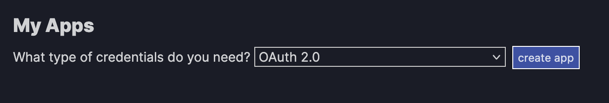
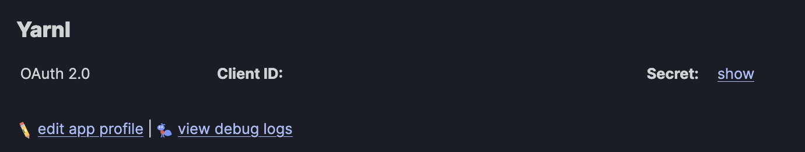
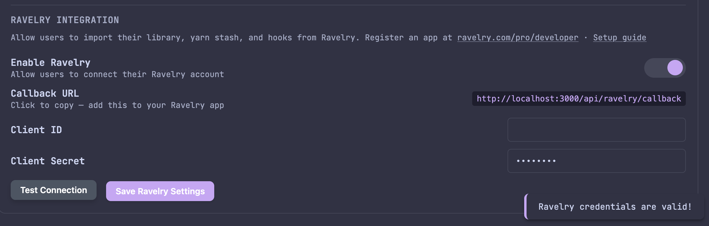
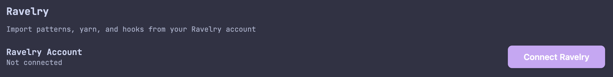

# Ravelry

:::note
Ravelry integration was added in **v0.9.0**.
:::

Yarnl integrates with [Ravelry](https://www.ravelry.com) to let you import your patterns, yarn stash, hooks, and favorites directly from your Ravelry account. This guide walks through registering a Ravelry app, configuring the integration in Yarnl, and importing your data.

:::warning HTTPS Required
Ravelry's OAuth API requires a valid HTTPS callback URL. Make sure Yarnl is accessible via HTTPS before setting up this integration.
:::

---

## Step 1 — Create a Ravelry App

Creating a Ravelry API app is free.

1. Go to [ravelry.com/pro/developer](https://www.ravelry.com/pro/developer) and log in
2. Select **OAuth 2.0** from the credentials dropdown and click **Create App**

   

3. Fill out the app registration form:

   | Field | Required | Value |
   |-------|----------|-------|
   | **Application Name** | Optional | e.g., `Yarnl` |
   | **Developer or company name** | Optional | Your name |
   | **App website** | Optional | Your Yarnl URL |
   | **Short description** | Optional | e.g., `Self-hosted pattern library` |
   | **Authorized Redirect URIs** | **Required** | `https://yarnl.yourdomain.com/api/ravelry/callback` |

   :::warning
   The Authorized Redirect URI must use **HTTPS**. Ravelry will reject plain HTTP callback URLs.
   :::

4. Save the app
5. Copy your **Client ID** and **Secret**

   

---

## Step 2 — Configure Yarnl

1. In Yarnl, go to **Settings → Admin**
2. Scroll to the **Ravelry Integration** section
3. Toggle **Enable Ravelry** on
4. Paste your **Client ID** and **Client Secret**
5. Click **Test Connection** to verify, then **Save Ravelry Settings**

   

The **Callback URL** shown in the settings panel is what you need to enter in Ravelry's Authorized Redirect URIs field.

---

## Step 3 — Connect Your Ravelry Account

1. Go to the new **Ravelry** tab that is now **Settings**
2. Click **Connect Ravelry**

   

3. You'll be redirected to Ravelry to authorize access. Click **Authorize**

   

   :::note
   This step will only work if you are accessing Yarnl from the HTTPS URL you registered as the callback.
   :::

---

## Step 4 — Import Your Data

Once connected, select the items you want to import and click **Import**.

The import modal has four tabs:

### Patterns

Your Ravelry pattern library — includes pattern name, designer, and category.

### Yarn Stash

Yarn from your Ravelry stash — includes brand, name, colorway, weight, and skein count.

### Tools

Hooks and needles from your Ravelry needle/hook inventory.

### Favorites

Patterns you've favorited on Ravelry.

---

## Import from a Ravelry URL

You can import any individual Ravelry pattern by URL — useful for free patterns or when you want to preview and customize before importing.

1. Click **+ Add** in the pattern library and select **Ravelry URL**

   

2. Paste the Ravelry pattern URL and click **Next**

   

   Yarnl checks PDF availability immediately. If no PDF is downloadable, an error is shown before you continue.

3. Review and edit the pattern details, then click **Import**

   

   You can edit the title, category, description, tags, rating, favorite, and in-progress status before importing. The `#ravelry` tag is pre-selected, and Ravelry category tags are suggested below the tag field.